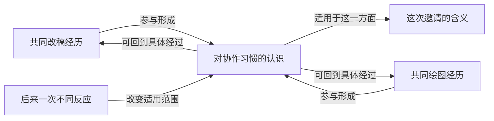
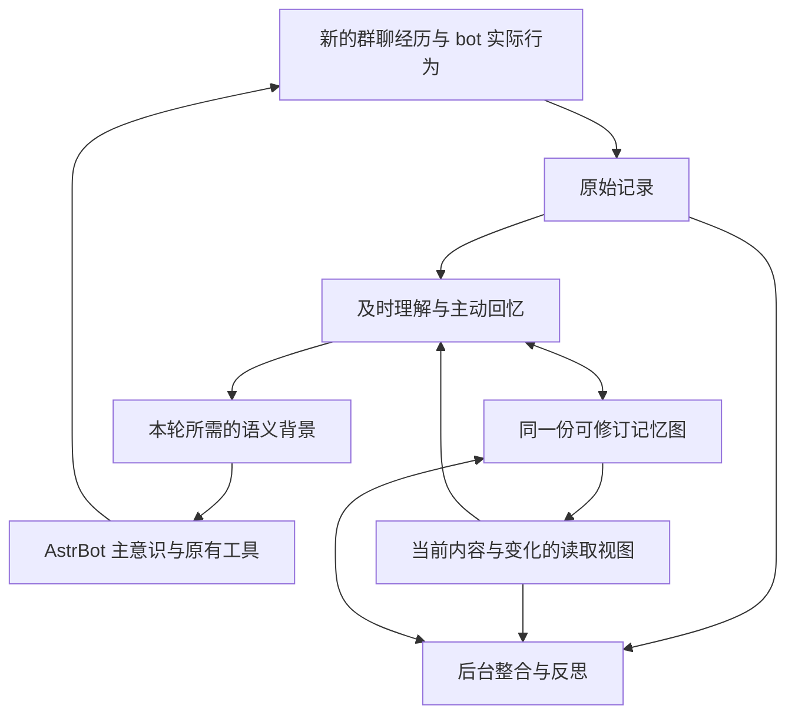

# 记忆重构：让共同经历持续改变之后的理解

状态：2026-09-19，开发准备。分支 `codex/mr-memory-redesign`，起点 `8478adf`。本文确定替换边界与首个实现闭环，尚未实现或验证新架构。README 的运行说明仍描述起点版本。

## 产品目标与重构判断

MR 为持续参与群聊的 bot 形成共同经历和可修订的理解。经历应影响之后如何理解人、关系、话题、隐含意思和自己的行为；主意识仍由 AstrBot 负责，外部搜索和动作仍由其他工具负责。

语义联系由潜意识模型理解、建立和改变。程序提供可访问的材料、记忆地址、连接、持久写入和资源调度，不另造一套规则来裁决昵称、玩笑、相关性或什么值得记住。自然语言认识可以保留不同视角、猜测和尚未解决的问题。

这次重构以完整路径为替换单位。现有能力中有用的部分必须有去处；错误的结构直接替换，不靠新旧两套认识长期并行来回避切换。没有实际读写用途的字段和模块不搬进新架构。

## 起点代码暴露的结构断点

| 已确认的实现 | 对产品的影响 | 替换决定 |
| --- | --- | --- |
| `store.py` 的 episode、semantic、topic 与 `plastic_nodes/edges` 分开；`_save_node` 新建节点的 `node_kind` 固定为 `entity` | 可以给节点起事件名，却不能直接把真实经历、认识或主题作为同一图的连接端点 | 统一可寻址的记忆对象，让经历与高层认识本身可连接 |
| `graph` 只按节点邻接或文本词查边，按边 ID 倒序；LLM 可以连续调用 | 有局部遍历，但缺少从线索选择方面、再选择内容的完整导航 | 保留主动搜索，重写图目录与双向导航接口 |
| `remember` 不允许新建 topic；修订 topic 的 `_replace_memory_sources` 删除 `topic_episodes`，只重建原文来源 | 高层结构不能正常生长，重述已有主题还会失去它到经历的连接 | 取消特殊的“只能改旧 topic”路径，高层认识与其他记忆同样可创建、连接、修订 |
| 来源引用只接原始消息；semantic 和 association 的来源角色统一写成 `SUPPORT` | 无法明确表达“这项理解来自哪些旧认识”“这段话后来反驳了什么” | 区分材料出处、理解依据和联想关系；关系含义由模型写明 |
| `utility`、`activation_count`、`last_activated_at`、`support_count`、`contradict_count` 等字段在运行源码中只有建表定义 | 字段并未构成可用的学习、激活或连接演化机制 | 新模型不保留这些空机制；以后只有实际使用、能说明收益的量才进入运行路径 |
| 前台 `reconstruct` 的工具表没有 `remember`；短期笔记、反馈状态、长期记忆分开更新 | 本次已经理解的变化不一定持久改变下一次读取 | 前台与后台共享读写协议和当前认识，持久修订不必等待夜间整理 |

这些事实足以决定结构重写；不据此宣称已经定位任意一次线上错误的全部成因。

## 图中究竟存什么

保留 SQLite 与现有原始消息记录。重新组织其上的记忆，不引入新的图数据库服务。

**记忆对象保存能独立阅读的含义。** 一段经历、一个人物的当前认识、概念、未完成的共同事项、跨经历的模式都可以成为对象。对象具有稳定地址、当前版本、标题、内容、线索与方面，以及适用语境和时间。语义类别可以由模型描述，不用封闭枚举决定什么内容允许存在；消息与记忆的地址类型只负责定位。

真实账号是“谁发送了这条记录”的平台事实。关于同一个人、称呼、扮演角色、谈论对象的理解放在记忆中。节点地址不是人物代号，同名不触发自动合并，多账号也不预先被规则裁定为同一个人或不同人。

**连接表达具体含义，并且可以被再次引用。** 连接具有自己的地址、端点、关系描述、适用语境及形成依据。端点能指向真实的记忆对象；必要时也能讨论某条已有连接。复杂事件用事件对象连接各方，并保留参与角色，不把多方互动强拆成没有语境的若干“认识”边。暂不实现通用超图框架。

同一存储中明确区分两类用途：

- 联想连接让模型知道“由此还能想到什么”，例如共同经历、类比、对照、同一讨论的不同方面。关联和图上可达本身不表示事实蕴含、因果或身份相同。
- 依据和修订连接让模型知道“这项认识怎样形成，后来怎样改变”。依据可以是原文、特定版本的经历或另一项认识；更高层认识不必把所有下层原文重新抄一遍。依据的含义由模型表达，不统一标成支持，也不设证据数量门槛。

对象和连接共享持久化的版本与历史。它们有可直接读取的当前内容；先前版本仍能解释过去为何那样理解。原始发言、机器人的实际回应与动作结果继续作为经历保留，纠正认识不等于改写历史。

### 高层连接必须能做什么

下面是完全虚构的结构示例，不是已发生的群聊或验收结果：

模型从多次经历形成“这些情境里大家倾向先看初稿再一起调整”的认识；它可以帮助理解措辞不同的新邀请。后来某次交流说明这只适用于一起创作、并不适用于所有请求，模型就修改适用范围，并调整相关连接。旧经历仍然可以重新阅读。这种认识能够再和其他认识形成新的模式，但不会自动升级为命令主模型的永久规则。

这要求一次学习能够创建高层对象、连接多段经历、改变旧内容和旧边，并在后续搜索中沿高层对象返回细节。仅给节点增加分类、打分或在前端画更多圆点不算完成。

## 统一的理解、回忆与修订路径

前台和后台是不同的工作时机，使用同一份认识和同一套写入操作。前台已经理解的变化可以在本次调用持久保存；较深的归纳、旧认识的重新解释和不急的探索继续按已有后台时间与额度运行。不是每条消息都额外启动一轮 LLM，也不在每次回复前增设审查调用。

输入需要让潜意识分清当前发言者、引用对象、主意识已经看见的近期内容与工具结果，以及自上次理解后有哪些新经历。近期 N 条不是“所有新交流已理解”的证明。间隔过长时提供未处理范围和可继续读取的入口，由模型处理有关部分并留下进度；不把未读区间默认为已学习。

短期状态只承载当前话题、注意力和未完思路，涉及持久认识时引用图中的地址与版本。后台完成的修订也通过同一读取视图到达前台，避免另有一份必须碰巧被搜到的“反馈真相”。

读取某条认识时，同时呈现影响它的已知变化。如果其形成依据有新版本，提供变化入口与原有依据版本；由模型决定保留、改写、拆开或撤回，不沿关联边自动判整片图失效。已经修订的对象默认读到当前版本；读旧版本时明确显示历史与当前的关系。

写入需要处理实际并发：修改同一个对象时携带读到的版本，若期间已有新修订，就返回现版本与差异供这次模型合并。范围限于正在修改的对象，不做全库哈希或逐条语义审批。不同对象的写入及已完成材料的进度独立落地，不能由一个失败草稿扣留全部工作。

## 导航接口与成本

恢复 MRAgent 的完整导航能力：**线索 → 方面 → 内容；内容 → 新线索与方面；主题或高层认识 → 具体经历**。词法、向量检索提供入口，读到的内容还能引出新的搜索方向。[MRAgent](https://arxiv.org/html/2606.06036v1) 为这种主动访问和多粒度结构提供研究依据；本文对共享写入、变化传播的选择是 MR 的产品设计，不是论文的既有证明。

目标接口按能力划分，不把每一步固定成一次串行模型调用：

| 操作 | 模型拿到什么 | 取舍由谁决定 |
| --- | --- | --- |
| 找入口 | 线索或内容的简短候选，含地址和必要语境 | LLM 决定查询与选取，向量相似度不代替身份或含义判断 |
| 看方面和连接 | 某对象有哪些可走的方向、关系描述、内容地址；可翻页、筛选、批量查阅 | LLM 选择方向；程序不自动展开固定 N 跳 |
| 打开内容 | 指定记忆当前内容、依据地址及相关修订；必要时读原文 | LLM 决定展开深度，目录不默认附带所有出处全文 |
| 改变记忆 | 新建或修改对象、连接、依据、线索和方面；返回真实地址与版本 | LLM 决定语义变化，程序保证保存和引用一致 |
| 延续思路 | 本次已经做过的工作、引用过的对象版本、接下来值得关注的线索 | 前后台复用，未读与未完保持可见 |

较高级的功能先通过“读取—理解—写回”发生，不预设扩散系数、PageRank 权重、自动衰减或身份归并规则。单独把访问频次变成语义重要性，会把频繁出现的旧误解变成更强的入口；是否值得强化、怎样分化，由模型结合新经历理解。读取统计以后可以帮助判断成本，但不能冒充真值。

高层模式减少常见路径的重复理解，目录减少不必要的正文读取，稳定提示词与工具表复用模型前缀，同一调用内复用已给出的内容。这些是成本优化的方向，不能以减少可访问材料或删除主动搜索能力来换一个更小的耗时数。

新结构允许按当前范围和所选方面分页，避免高连接度人物的一次查询把全部邻居塞入上下文。分页需保留“还有更多”的出口；排序用于导航，不给低排名认识判无效。串行依赖的推理轮次仍有真实延迟，不承诺零代价的多跳理解。

后台产能要用实际新完成材料、有效记忆变化、输入/缓存/输出费用观察。积压不靠改状态消失。共用记忆后仍保留用户配置的不同后台额度与工作时间，避免把共享认识错误实现成无限共享费用。

## 模块与替换边界

| 边界 | 保留的责任 | 本轮大改要替换的路径 |
| --- | --- | --- |
| `main.py`、`content.py`、`conversation.py` | 平台接入、作者/引用/实际发送记录、主模型交付与会话管理 | 从主钩子中分离学习调度和输入组装；接入同一当前记忆视图 |
| `store.py` | 原始记录、成员平台资料、现有用量和处理进度的真实数据 | 将记忆对象、连接、版本与索引交给单一记忆存储边界；移除旧四类独立写入和实体专属图路径 |
| `agent.py` | 原生 provider 调用、工具返回、模型用量 | 重写导航、记忆读写和上下文组装；及时理解与后台复用能力，避免继续把所有协议塞进一个代理类 |
| `learning_writes.py`、`reflection.py` | 独立草稿恢复、续接线索、反思的工作安排 | 统一内容写入；反思任务引用同一图中的认识，不再另存一套无法及时读到的结论 |
| `embedding.py` | 本地模型生命周期、实际向量推理 | 索引新对象和导航入口；索引是可重建的访问方式，不是另一份记忆权威 |
| `schedule.py`、`settings.py`、`tool_calls.py` | 用户设置、服务当地工作时间、用量边界、原生工具参数处理 | 按新的调用责任接线，不重设既有配置，不丢掉已修好的真实传输问题 |
| `console.py`、`pages/console/`、`trace.py` | 可读的调用过程、消息、记忆、配置及手动修复入口 | 图详情显示真实的经历—认识—模式—修订及其路径；前端跟随同一数据接口改造 |

边界用于减少相互牵连，不预先创建空模块或通用框架。原始记录、记忆存储、访问工具、调用编排、后台调度、控制台各有单一状态归属；具体拆文件随实际实现确定。

迁移是一次明确的数据转换，不是常驻兼容读写。旧经历、语义认识、主题、节点和关联各有新地址映射；保留原文、来源、修订历史与已有连接，不凭标签替用户合并人物，也不花模型费用重新生成全库。旧向量只有在文本与编码身份均匹配时才能复用，其余进入正常索引工作。旧工作状态和反思中的记忆引用同样转换，不能只迁表而留下失效的入口。

切换新记忆路径时同时移除旧读取、旧写入、旧工具定义和依赖它们的测试假设。迁移逻辑单独承担历史数据兼容；运行时只有新路径。不要留下一个“新图模块”却仍让全部调用走旧表，也不要为了目录整洁再次丢弃前端或用户设置。

## 第一个实现闭环与完成条件

首个闭环：**一段交流形成可写的认识及连接 → 后续交流读到它 → 新信息改变它 → 换话题后或重提旧经历时仍能读到改变后的含义**。经历能够向上形成模式，也能够从模式向下返回具体经过。它同时贯通存储、工具、前台读写、后台复用、索引和控制台，不能用一个孤立的新表算完成。

开发顺序围绕这个闭环：先确定可寻址对象、连接与修订的实际读写，随后把导航和模型写入接进真实调用，再切换当前视图及后台续接，控制台同步接入。每次替换都移除对应的旧路径；新路径接通前不删除仍承担实际功能的部分。

验收先由开发者读少量完整互动，覆盖自然转述、纠正、换话题和重新提起旧经历，以及跨经历形成高层认识的过程。使用相同主模型、人格、群聊上下文和可用工具；需要动作的案例须有实际工具过程。没有图片或其他材料的复现不能作为等价环境的成功证据。

具体看：

1. 已理解的变化是否真实保存，且之后实际回复采用了它；“注入成功”不是这个结果。
2. 是否出现由模型形成并实际使用的高层连接；它是否能返回经历、因新信息改变，而不只是多存一段总结。
3. 作者、谈论对象、引用、bot 自己的猜测是否在完整交流里被正确理解；可回看原文能否帮助真正修正。
4. 主意识拿到的是本轮有用的背景，而非重复旧会话或替它规定回复；背景长短随实际需要变化。
5. 保存过的认识是否减少重复工作；比较实际费用、缓存用量、耗时与遗漏，同时看后台处理量能否覆盖新消息增长。

代码测试仅验证这次改动的存储/引用/版本/调用契约；模型能否形成有用理解必须另外观察，不能用合成返回或测试数量代替。未测前不设臆造的收益百分比，不把用户先前设定改成新的默认数值。

高层反思可以再次参与理解、以及新记忆促使旧表示和连接演化，分别可参考 [Generative Agents](https://arxiv.org/html/2304.03442v2) 和 [A-Mem](https://arxiv.org/html/2502.12110)。这些研究支持值得实现的机制；并不证明本插件的模型、预算和群聊环境一定达到相同结果。
