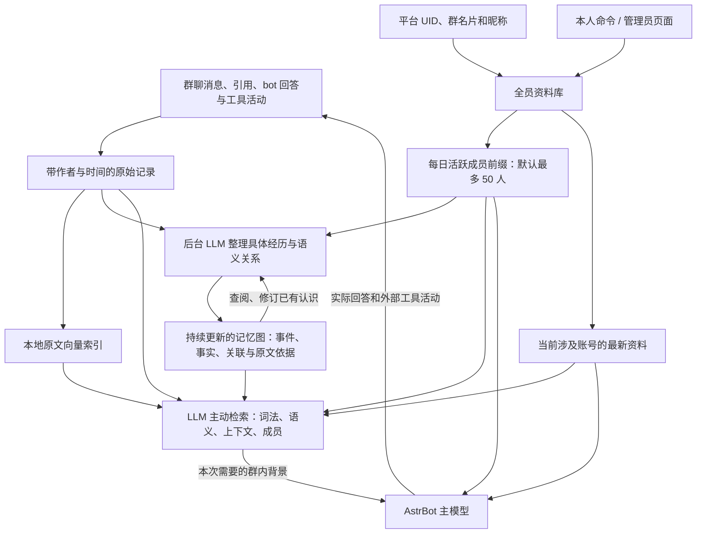

# MR 当前架构与实验边界

MR 的长期目标是让 bot 通过共同经历理解群聊，而不只是积累摘要。当前模型在人物归属、反讽和纠正传播上仍不稳定，因此默认持续构建可检索的基础记忆图、明确账号资料、让模型主动查找来历，为 AstrBot 提供语义背景。高级反思与抽象联系暂缓启用，基础建图继续运行。

## 默认运行路径

基础模式将写入放在后台整理，回答前只读检索。后台模型保存具体事件、自述及语义关联、检索线索和原文依据，按材料修订已有认识，包括明确纠正；不启动独立反馈学习、持续注意回流或高阶反思。原文索引是并行的直接访问路径，不能代替语义记忆建图。新消息在整理前也能查询；模型摘要不被视作经过认证的独立事实。

## 人物对应与前缀

UID 负责账号身份，语言模型负责语义指代。不能把昵称相同作为合并账号的依据，也不能把 UID 当成一句话所有经历的归属。资料层保存平台观察及本人／管理员显式填写，不以模型猜测自动制造“公认外号”。

全员资料库不限 50 人。每天按近七天群友发言量选择活跃子集，UID 稳定排序，冻结当天前缀快照。无变化则跨天复用相同文字；显式资料修正即时更新对应成员。新名片同时通过当前账号资料提供，不必为每条消息重排公共前缀。缓存命中仍计费且占上下文，实际缓存量以供应商返回为准。

调用内原文和已读记忆复用既有地址，保留新字段及发生变化的正文。固定说明、工具定义和成员名单置于动态消息之前。程序不通过关键词规则决定这句话是否值得记忆或应查什么；模型根据读到的内容继续搜索。

## 模块职责

| 模块 | 责任 |
| --- | --- |
| `profiles.py` | 平台观察、完整目录、显式编辑、每日前缀 |
| `store.py` / `memory_graph.py` | 原文、记忆、来源和可寻址读取，保留旧数据 |
| `agent.py` / `memory_protocol.py` | 回答前检索、基础整理建图与实验模式的任务/工具边界 |
| `embedding.py` | 本地语义向量，独立于付费模型整理 |
| `handoff.py` / `request_context.py` | 主意识输入访问及背景交付 |
| `learning_writes.py` | 基础及高级模式共用的记忆写入与独立材料进度 |
| `cognition.py` | 高级实验的关注及理解经验回流 |
| `main.py` | 生命周期、事件接入、自助命令、资源调度 |
| `console.py` / `pages/console/` | 管理资料、检索和真实运行过程 |

## 保留的高级实验

基础图已经允许事件、语义记忆及其联系，也保留不确定性与修订。显式开启 `advanced_memory_enabled` 后，增加跨经历抽象、连接的再连接、持续关注与理解经验回流。`remember` 共用于基础和高级记忆写入，`reflect` 只在高级模式安排后续反思；后台整理与反馈使用各自额度。切换模式时旧任务和草稿分别暂停保存，避免关闭反思却仍恢复旧反思上下文；基础整理可直接继续未处理原文。

原始发言、模型解释、调用时材料及后来的真实回应分别保存。不确定性由模型表达，访问频率不自动兑换事实置信度，沉默不视作认可。模型读到负面评价也可能误解，因此持续反馈反思暂不默认启用；基础整理仍保留来源和不确定性。

主动搜索保留根据中间证据调整后续访问的能力。高层联系是否带来迁移、能否稳定修正人际误认，需要未见真实互动证明；图更复杂、调用成功或写入有效都不能代替这种证明。基础与高级是明确的产品模式，不以关掉能力后的耗时冒充同等能力提速。

## 验证的含义

聚焦验证覆盖全员持久保存、前缀人数与每日稳定性、同名 UID 分离、本人命令不能指定他人、资料进入两个模型及新原文向量检索。原生模型检查用于发现真实输出问题，不能把结构测试或少量完成调用当作社交理解达标。

私有理解评测将题目输入与事后材料分开，保留实际作者、引文和工具记录，单独标明媒体是否可得。助理初答待人工核查；不得通过改变题目、给选项或把自己的回答视作正确答案制造通过分数。语料和逐题结果不进入仓库。
